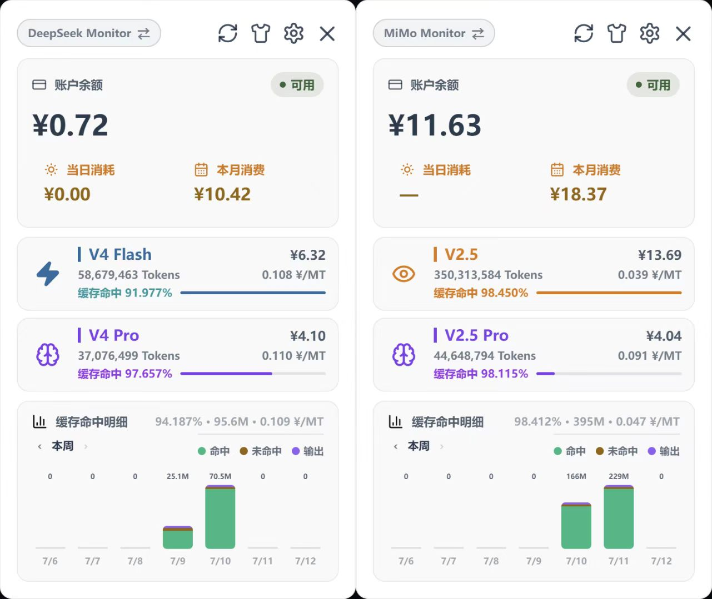

# DeepSeek Monitor Windows

Windows 桌面端 DeepSeek / MiMo API 用量监控工具，查看账户余额、消费统计、模型 Token 用量和趋势图。

基于 [JayHome137/deepseek-monitor](https://github.com/JayHome137/DeepSeekMonitor) 的开源思路，经由 [Joyi-code/DeepSeekMonitorWindows](https://github.com/Joyi-code/DeepSeekMonitorWindows) 完成 Windows 适配。本分支在其基础上合入了两个分支的功能并重新设计了 UI：

- MiMo 平台查询支持，参考自 [HaoyueQin/DeepSeekMonitorWindows](https://github.com/HaoyueQin/DeepSeekMonitorWindows)
- Windows DPAPI 加密存储，参考自 [KerryChia/DeepSeek_Monitor_for_Windows](https://github.com/KerryChia/DeepSeek_Monitor_for_Windows)

**郑重声明：本项目不是 DeepSeek 官方产品。**

## 界面预览



## 功能特性

### 双平台支持

- **DeepSeek**：API Key 余额查询、用量 Token 同步、V4 Pro / V4 Flash 模型统计
- **MiMo**：小米账号登录、余额查询、用量数据展示
- 主界面 Provider 切换器一键切换两个平台

### 用量监控

- 当日消耗、本月消费实时展示
- 按模型维度展示 Token 总量、缓存命中率、费用
- 最近 7 天消费趋势柱状图
- 模型详情页：每日 Token 明细、缓存命中 / 未命中 / 输出拆分

### 设置与通知

- 余额不足时 Windows 系统通知，支持自定义阈值和冷却时间
- DeepSeek / MiMo 刷新间隔独立配置
- 开机自启、自动刷新开关
- 浅色 / 深色 / 跟随系统主题切换

### 安全

- API Key 和用量 Token 通过 Windows DPAPI 加密存储，不在配置文件中明文保留
- MiMo 账号凭据本地加密保存

### UI 设计

- 356px 紧凑面板，系统托盘常驻
- 卡片式分类导航，圆角边框 + hover 过渡动画
- 表单元素统一风格（Mimo 设计语言）
- 余额数字切换时高度固定，无抖动

## 系统要求

- Windows 10 / 11
- Microsoft Edge WebView2 Runtime（Windows 11 通常已内置）
- Node.js 18+ 和 npm
- Rust 1.77.2+（MSVC 工具链）
- Visual Studio Build Tools（Desktop development with C++）

## 安装与开发

```powershell
git clone https://github.com/Bronzesakon/DeepSeekMonitorWindows.git
cd DeepSeekMonitorWindows
npm install
npm run tauri:dev
```

构建安装包：

```powershell
npm run tauri build
```

NSIS 安装包产物位于 `src-tauri/target/release/bundle/nsis/`。

## 使用方式

1. 打开设置页，配置 DeepSeek API Key（来自 [DeepSeek 开放平台](https://platform.deepseek.com)）。
2. 用量统计需要网页登录 Token（与 API Key 不同）：
   - **方式一**：点击"网页登录自动同步"，在弹出窗口完成登录，应用自动从 WebView2 缓存提取 Token。
   - **方式二**：手动从浏览器控制台获取 `JSON.parse(localStorage.userToken).value` 并粘贴。
3. MiMo 平台：点击"打开 MiMo 登录"，在弹出窗口登录小米账号即可。
4. 切换到 MiMo 后，主界面自动切换为 MiMo 数据视图。

Token 可能过期，用量查询失败时重新同步即可。

## 数据存储

配置文件位于：

```text
%APPDATA%\DeepSeekMonitorWindows\config.json
```

API Key、用量 Token 和 MiMo 凭据已通过 Windows DPAPI 加密存储。**请勿提交该文件或公开其中内容。**

## 项目结构

```text
DeepSeekMonitorWindows/
├── src/                         # React + TypeScript 前端
│   ├── main.tsx                 # 主界面、设置页、详情页
│   ├── components/
│   │   ├── DashboardPanel.tsx   # 主面板（余额卡、用量行、趋势图）
│   │   ├── SettingsPanel.tsx    # 设置页（账户、通用、显示、通知、关于）
│   │   └── ModelDetailPanel.tsx # 模型详情页
│   └── styles.css               # 全局样式
├── src-tauri/                   # Tauri + Rust 后端
│   ├── src/
│   │   ├── lib.rs               # Tauri 命令、配置管理
│   │   └── modules/
│   │       ├── config.rs        # 配置读写 + DPAPI 加密
│   │       ├── deepseek.rs      # DeepSeek API 调用
│   │       ├── mimo.rs          # MiMo API 调用
│   │       ├── tray.rs          # 系统托盘
│   │       └── types.rs         # 类型定义
│   ├── capabilities/            # Tauri 权限配置
│   └── tauri.conf.json
├── scripts/                     # 构建脚本
├── package.json
└── LICENSE
```

## 依赖

**前端**：React 18、Tauri JS API 2、lucide-react、Vite 5、TypeScript 5

**后端**：tauri 2、tauri-plugin-log、tauri-plugin-single-instance、reqwest 0.12、serde、notify-rust、tiny_http

## 更新日志

完整发布记录见 [GitHub Releases](https://github.com/Bronzesakon/DeepSeekMonitorWindows/releases)。

### v2.0.0

- 新增 MiMo 平台余额查询与用量统计，支持小米账号登录同步
- 集成自动更新机制
- 余额不足 Windows 通知，支持自定义阈值
- 后端模块化重构（config / deepseek / mimo / tray / types）
- 设置页 UI 重构：标题栏、卡片式分类、Mimo 风格表单
- 修复切换服务商时余额数字高度抖动
- 死代码清理：移除未使用导入、CSS 类、后端依赖
- 更新 MIT 许可证

### v1.1.0

- 缓存命中 / 未命中 / 输出 Token 明细显示
- 亮色 UI 皮肤切换
- 设置页版本号显示

### v1.0.1

- 修复单实例缺失导致的重复多开问题

### v1.0.0

- 首个发布版本：DeepSeek API 余额查询、用量统计、消费趋势、托盘入口

## 许可证

本项目使用 [MIT License](LICENSE)。

## 免责声明

本项目仅用于学习和研究目的。请遵守 DeepSeek 和小米的使用条款，合理使用相关接口。API Key 和凭据已通过 DPAPI 加密存储在本机，但使用者仍需自行承担账号安全和数据展示带来的风险。
